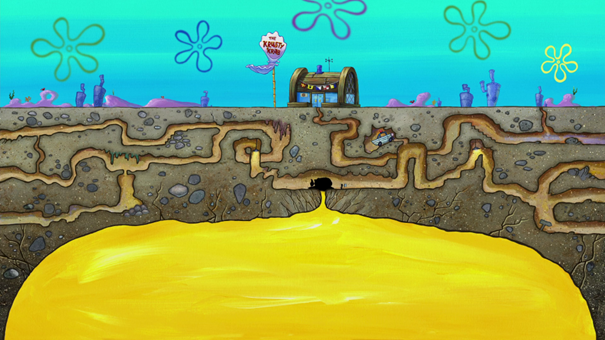

# Tubes2_MazeRunner
Tugas Besar 2 IF2211 - Strategi Algoritma
Tahun 2022/2023

## Daftar Isi
* [Deskripsi Persoalan](#deskripsi-persoalan)
* [Keperluan Program](#keperluan-program)
* [Cara Meng-*compile* Program](#cara-meng-compile-program)
* [Cara Menggunakan Program](#cara-menggunakan-program)
* [Pembuat Program](#pembuat-program)

## Deskripsi Persoalan
Tuan Krabs menemukan sebuah labirin distorsi terletak tepat di bawah Krusty Krab bernama
El Doremi yang Ia yakini mempunyai sejumlah harta karun di dalamnya dan tentu saja Ia ingin
mengambil harta karunnya. Dikarenakan labirinnya dapat mengalami distorsi, Tuan Krabs harus terus
mengukur ukuran dari labirin tersebut. Oleh karena itu, Tuan Krabs banyak menghabiskan tenaga
untuk melakukan hal tersebut sehingga Ia perlu memikirkan bagaimana caranya agar Ia dapat
menelusuri labirin ini lalu memperoleh seluruh harta karun dengan mudah.

Dalam tugas besar ini, diperlukan sebuah aplikasi dengan GUI sederhana
yang dapat mengimplementasikan BFS dan DFS untuk mendapatkan rute memperoleh seluruh
treasure atau harta karun yang ada. Program dapat menerima dan membaca input sebuah file txt
yang berisi maze yang akan ditemukan solusi rute mendapatkan treasure-nya. Untuk mempermudah,
batasan dari input maze cukup berbentuk segi-empat dengan spesifikasi simbol sebagai berikut :
* K : Krusty Krab (Titik awal)
* T : Treasure
* R : Grid yang mungkin diakses / sebuah lintasan
* X : Grid halangan yang tidak dapat diakses

## Keperluan Program
* .NET SDK 7.0
* Avalonia

## Cara Meng-*compile* Program
Lakukan pada terminal di *root directory* dari *repository* ini
1. `dotnet build`
2. `dotnet run`
3. ...

## Cara Menggunakan Program
1. ...
2. ...

## Pembuat Program
* Hosea Nathanael Abetnego (13521057)
* Nicholas Liem (1352113)
* Rava Maulana (13521149)
